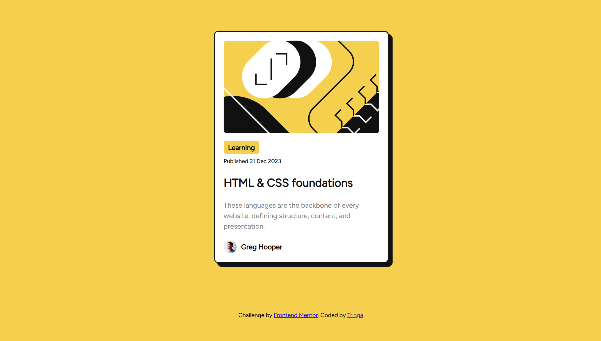

# Frontend Mentor - Blog preview card solution

This is a solution to the [Blog preview card challenge on Frontend Mentor](https://www.frontendmentor.io/challenges/blog-preview-card-ckPaj01IcS). Frontend Mentor challenges help you improve your coding skills by building realistic projects. 

## Table of contents

- [Overview](#overview)
  - [Screenshot](#screenshot)
  - [Links](#links)
- [My process](#my-process)
  - [Built with](#built-with)
  - [What I learned](#what-i-learned)
  - [Continued development](#continued-development)
- [Author](#author)
- [Acknowledgments](#acknowledgments)

**Note: Delete this note and update the table of contents based on what sections you keep.**

## Overview

### Screenshot

### Links

- Solution URL: [Github Link Solution](https://github.com/tringakrasniqi/frontend-challenges/tree/main/blog-preview-card)
- Live Site URL: [Add live site URL here](https://your-live-site-url.com)

## My process

### Built with

- Semantic HTML5 markup
- CSS custom properties
- Flexbox
- CSS Grid
- Mobile-first workflow

### What I learned

Used this challenge to refresh my CSS skills and find out some nice tools like the box shadow generator. 

### Continued development

In my next challenge I will use Tailwind to get more familiar and efficient with it.

## Author

- Website - [Tringa Krasniqi](https://www.tringakrasniqi.com)
- Frontend Mentor - [@tringakrasniqi](https://www.frontendmentor.io/profile/tringakrasniqi)
- Instagram - [@tringacodes](https://www.instagram.com/tringacodes)

